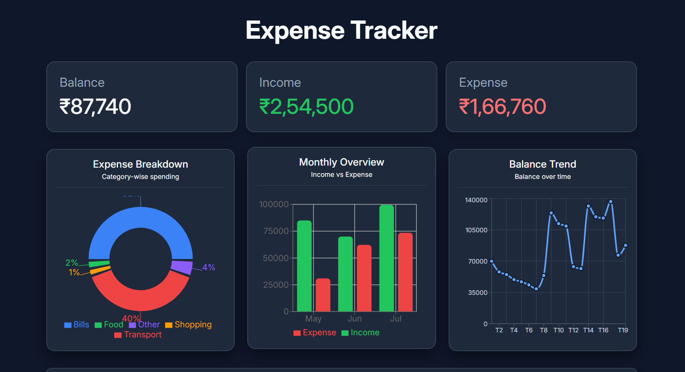
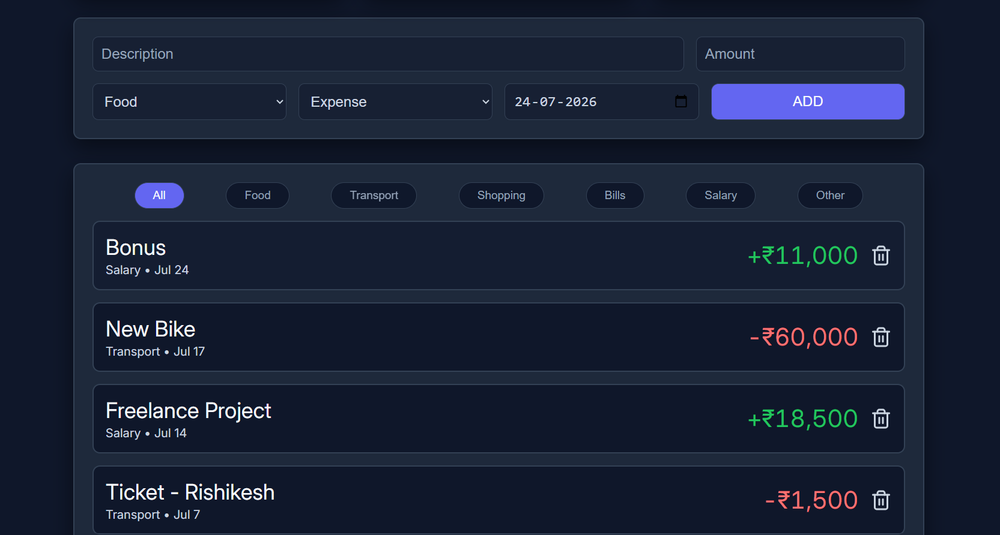

# 💰 Expense Tracker

A modern, responsive **Expense Tracker** built with **React.js** that helps users manage their finances by tracking income and expenses, filtering transactions, and visualizing spending trends through interactive charts. All data is stored locally using the browser's **Local Storage**, so your transactions remain available even after refreshing the page.

---

## 🔗 Live Demo

🌐 **Live Website:** https://expense-tracker-yashsoni.vercel.app/

---

## 📸 Demo





---

## ✨ Features

- ➕ Add income and expense transactions
- 🗑️ Delete transactions
- 💳 Automatic calculation of:
  - Current Balance
  - Total Income
  - Total Expenses
- 📂 Filter transactions by category
- 📅 Add transaction dates
- 💾 Persistent data storage using Local Storage
- 📊 Interactive data visualization with Recharts
  - Expense Breakdown (Pie Chart)
  - Monthly Income vs Expense (Bar Chart)
  - Balance Trend (Line Chart)
- 📱 Fully responsive design for desktop, tablet, and mobile
- 🎨 Clean modern dark-themed user interface

---

## 🛠️ Tech Stack

| Technology | Purpose |
|------------|---------|
| React.js | Frontend UI |
| JavaScript (ES6+) | Application Logic |
| CSS3 | Styling & Responsive Design |
| Recharts | Data Visualization |
| React Icons | Icons |
| Local Storage API | Persistent Data Storage |

---

## 📊 Charts Included

### 🥧 Expense Breakdown
Displays category-wise expense distribution using a Pie Chart.

### 📈 Monthly Overview
Compares monthly income and expenses using a Bar Chart.

### 📉 Balance Trend
Shows how the account balance changes after each transaction using a Line Chart.

---

## 📂 Available Categories

- 🍔 Food
- 🚗 Transport
- 🛍️ Shopping
- 🧾 Bills
- 💰 Salary
- 📦 Other

---

## 📁 Project Structure

```
Expense-Tracker/
│
├── src/
│   ├── App.jsx
│   ├── ExpenseTracker.jsx
│   ├── Graphs.jsx
│   ├── index.css
│   └── main.jsx
│
├── package.json
├── vite.config.js
└── README.md
```

---

## 🚀 Getting Started

### 1. Clone the repository

```bash
git clone https://github.com/codewithyashsoni/Expense-Tracker.git
```

### 2. Navigate to the project folder

```bash
cd expense-tracker
```

### 3. Install dependencies

```bash
npm install
```

### 4. Start the development server

```bash
npm run dev
```

### 5. Open in your browser

```
http://localhost:5173
```

---

## 💾 Data Storage

All transactions are stored in the browser using **Local Storage**. This allows your data to remain available even after refreshing or reopening the application.

---

## 📱 Responsive Design

The application is optimized for:

- 💻 Desktop
- 💼 Laptop
- 📱 Tablet
- 📲 Mobile Devices

---

## 📚 What I Learned

Building this project helped me strengthen my understanding of:

- React Components
- React Hooks (`useState`, `useEffect`)
- State Management
- Component Communication using Props
- Conditional Rendering
- Array Methods (`map`, `filter`)
- Local Storage API
- Responsive Design with Flexbox
- Building Interactive Charts with Recharts
- Modern UI Design Principles

---

## 🔮 Future Improvements

- ✏️ Edit existing transactions
- 🔍 Search transactions
- 📤 Export transactions to CSV or PDF
- 🎯 Monthly budget planning
- 🔄 Recurring transactions
- 👤 User authentication
- ☁️ Cloud database integration
- 🌙 Light/Dark theme switch
- 💱 Multiple currency support

---

## 🤝 Contributing

Contributions, suggestions, and improvements are welcome.

1. Fork the repository
2. Create a new branch

```bash
git checkout -b feature-name
```

3. Commit your changes

```bash
git commit -m "Add feature"
```

4. Push to your branch

```bash
git push origin feature-name
```

5. Open a Pull Request

---

## 👨‍💻 Author

**Yash Soni**

- GitHub: https://github.com/codewithyashsoni

---

## 📄 License

This project is licensed under the **MIT License**.